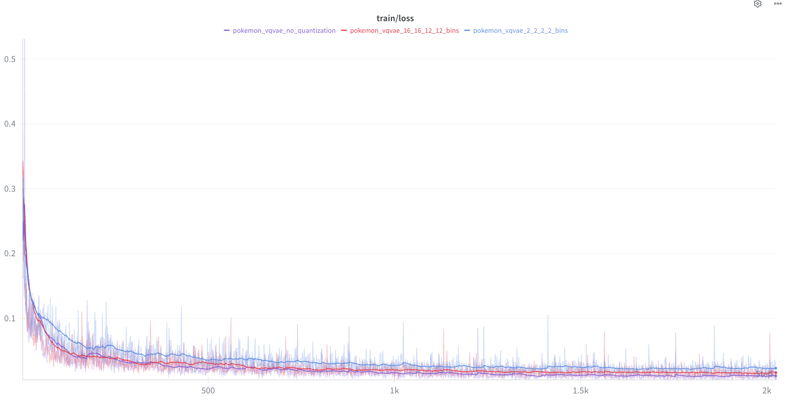
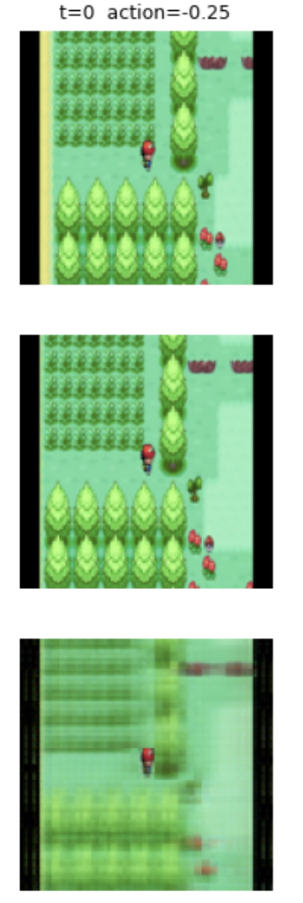
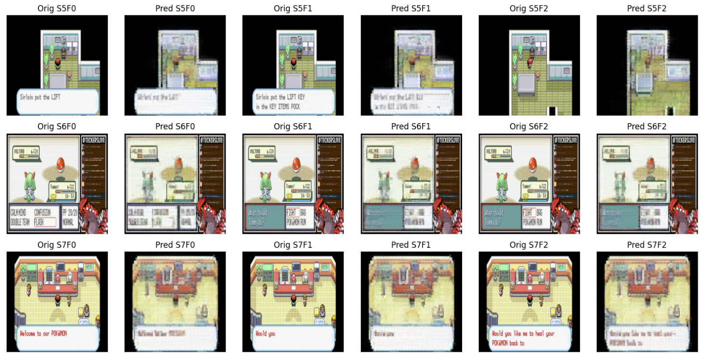
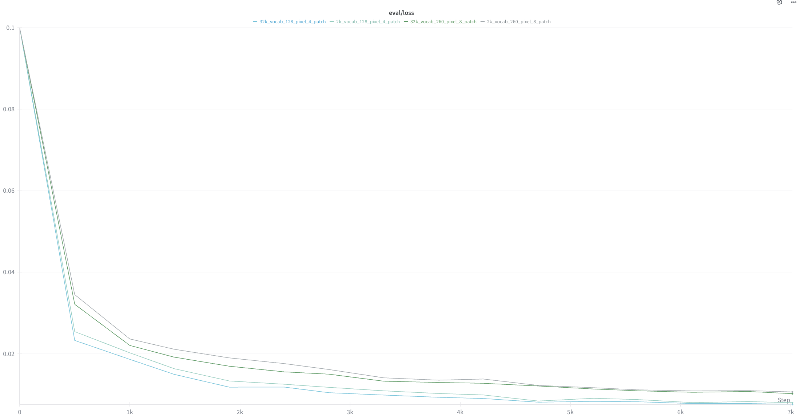
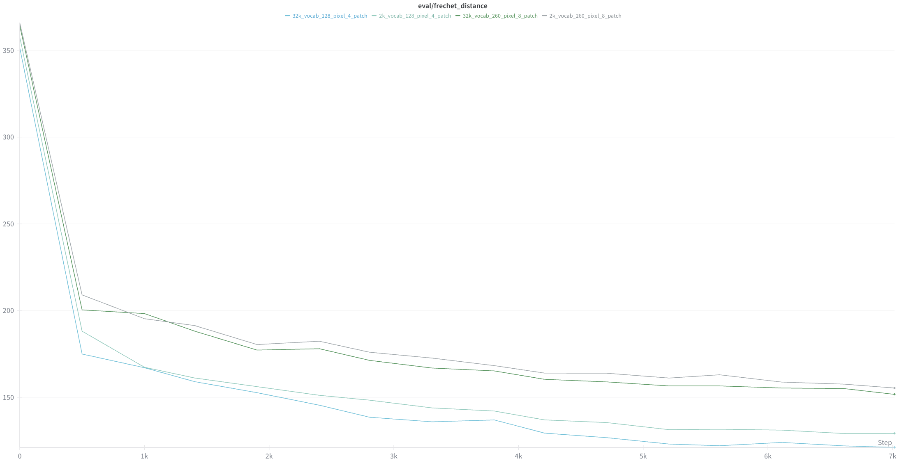
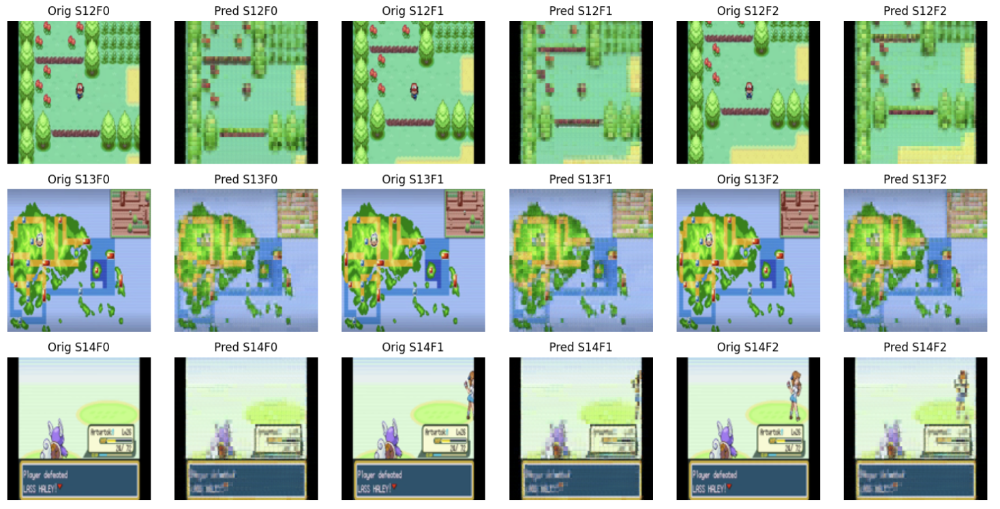
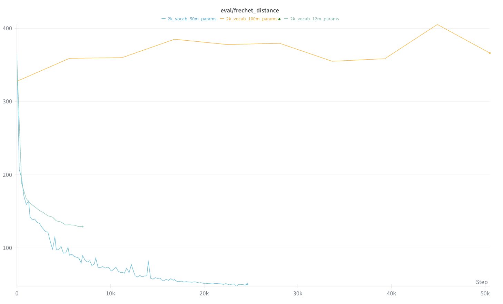
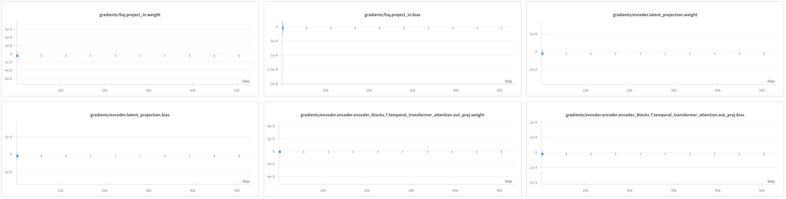
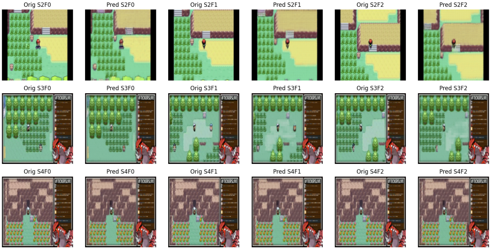

# Pokemon IDM

The goal of this is to train a viable latent action IDM that understands the action space of pokemon. This IDM is completely self-supervised and is implemented with a VQVAE using the NSVQ paper. Ultimately, I am working on using to a flow matching diffusion transformer to generate the subsequent frames.

Because many pairs of frames are the same, I modified the reconstruction loss to focus more when the pixels change. This acts as a form of regularization and focus, preventing us from just reconstructing the original image.

## Data Collection

We can scrape a bunch of youtube videos with the following:
```
python -m src.data.scraping.pokemon_dataset_pipeline --clean --extract --summary --extract --jump_seconds 5.0 --num_video_workers 8 --num_upload_threads 16 --use_s3
```
Our end state is to have groups (starting with "pairs" i.e. group of 2) from which we can learn our latent actions. This means that we need to pair up frame x and frame x+1. Eventually, I will roll out support for larger groups, since the learning dynamics should be smoother.

## Training

Starting with the Finite State Quantization (FSQ) for our tokenizer, we want to understand the impact of the quantization bins. Ideally, we are able to overfit on a small set first. So, we run two experiments:
- **Sending information through a straw**: We restrict our bins to be 2 2 2 2, meaning that we will lose a lot of information in our tokenization. Our vocab size is only 16 here.
- **Light Quantization**: Use bins 16 12 12 12, allowing vocabulary size of 36,864.

We expect to see an enormous delta, but it is much smaller than anticipated. So, let's try removing quantization entirely. Our encoder/decoder should just learn the identify function. 

Ablation results (see below):



## Training Video Tokenizer
Local training
```python -m scripts.video_tokenizer.train --frames_dir pokemon_frames/pokemon_emerald --num_images_in_video 5 --batch_size 2  --save_dir fsq_full_train --checkpoint_dir full_train --bins 8 8 6 5 --local_cache_dir ''```

S3 
```
python -m scripts.video_tokenizer.train --frames_dir pokemon_frames/pokemon_emerald --num_images_in_video 5 --batch_size 2  --save_dir fsq_full_train --checkpoint_dir full_train --bins 8 8 6 5 --use_s3 true
```

### TODOS

- [ ] Flow Matching Transformer
- [ ] Larger group dynamics (not just pairs)
- [ ] Do we really need video tokenization or would frame tokenization suffice?
- [X] Use additive embeddings
- [X] Move to single action per frame
- [ ] When char is moving, everything should be moving. Filter to frames where the residual is every frame or nothing
- [ ] Use EMA codebook updates
- [ ] Just look at center of the frames to determine action
    - [ ] Can't because some frames are un-cropped
- [ ] Deal with codebook collapse (tried resetting but just collapses elsewhere; might want to focus on center frame, only care about the char)
- [ ] Use more homogeneous data
- [ ] Handle emergence of no-action quantization; successfully classify when there is no action
- [ ] Test out JEPA style learning
- [ ] Test out DiT
- [ ] Test out BPTT using Gumbel Softmax for iterative decoding (bridge train/inference gap)
- [ ] Fix data leakage between train/test (the test set can be interspersed with segments from training)
- [ ] Trim out the borders present

#### Data

- [x] Process parallelism
- [x] Loss is wrong
- [ ] Koga gym is known poisonous bc of teleportation
- [ ] Horrible Heart Gold/Soul Silver
- [ ] When we enter into trainer battle
- [ ] We cannot tell when the frame is exactly the same


## Data Scripts

```
python -m scripts.data.sync_dataset_to_s3 --source pokemon_frames/pokemon_emerald_train_0_9_5_frames.json --bucket [bucket_name] --verbose
```

## Observations

### Latent Action Model
During training, the easiest way to minimize the loss early is to just regurgitate the previous frame. Over time, this transitions to learning a sort of middle ground between the previous and next frame. This manifests as somewhat of a motion blur, where you see the previous frame and the current frame together. Below is an example of this phenomena. This is from epoch 50 over a dataset of only 100 frame transitions



Eventually we overfit and learn the exact next frame. I am working on experiments of this at scale.


### Video Tokenizer

We first train a 12 million parameter tokenizer. We select Finite Scalar Quantization (Mentzer, 2023) because of the simplicity and the empirical lack of quality degradation when scaling vocab size. This tokenizer is trained with 2 heads, 2 encoder layers, 2 decoder layers, d_model = 256, image shape = 260x260, patch_size = 8, and a vocab size of 1,920. Our results are _decent_, but we certainly are leaving a lot on the table. 


In the genie papers, they train a 200 million parameter encoder with vocab size of 1k. Their tokenizer views images as 160x90, using a patch size of 4. It is worthwhile for us to run some ablations over the different image qualities and vocab sizes.



As expected, increasing vocabulary size improves performance. However, this also creates a more difficult learning objective downstream. We see that the largest delta actually comes from scaling the image quality. There is a ~20% improvement in frechet distance simply by dropping from 260x260 with a patch size of 8 to 128x128 with a patch size of 4. As a result, we opt to use this moving forward.


These results are empirically a bit better, but they still don't pass the eye test. We want to feel like we're actually in the game, and the video tokenizer decoder is integral to the reconstruction performance of our dynamics model downstream. So, we'd like to see the impact of scaling the tokenizer itself. We opt for a 50m and 100m model by scaling d_model to 512 and using num heads = 8, setting encoder/decoder layers to 4 and 8 respectively. 


Something is clearly not right with our 100m tokenizer... Let's take a look


It seems that we converge on some local minima. Let's take a look at our gradients:

The gradients are only active during the first ~5k steps. Since we're using gradient accumulation of 16, This means we really only take 300 steps before converging to our local minima. Let's try adding some better weight initialization, dropping our learning rate, and adding a warmup.

I'm reasonably happy with the 50m model performance and it comes at a pretty cheap latency hit. Here are some eval samples:


Genie explores scaling the decoder separately. Since the decoder is essentially the bottleneck for reconstruction fidelity, this is worthwhile to pursue. I may come back to this.

- 12M Tokenizer: https://wandb.ai/adb262-cornell-university/pokemon-vqvae/runs/lhek7ncp
- 50M Tokenizer: https://wandb.ai/adb262-cornell-university/pokemon-vqvae/runs/mu0wmzo3
- 100M Tokenizer: https://wandb.ai/adb262-cornell-university/pokemon-vqvae/runs/t0e7zv8b


**You'll notice that a lot of the frames have not been trimmed. I originally removed these artifacts but decided that they actually may improve diversity of generation over time.