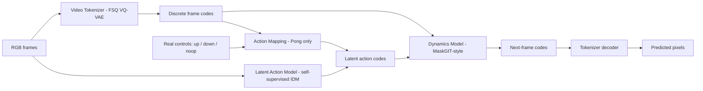

# Pokémon → Pong World Model

A self-supervised **action-controllable video world model**, in the spirit of [Genie](https://arxiv.org/abs/2402.15391). Given a few frames of gameplay and an action, the model predicts the next frame — without ever being told what the actions *are* during pretraining. Actions are discovered automatically from raw video.

The project began on Pokémon (hence the name) and now uses **Pong** as a clean, controllable testbed for proving out the full pipeline end to end. You can play a fully model-generated game of Pong with your keyboard — every frame is hallucinated by the dynamics model.

> **Status:** research codebase under active development. The pipeline works end to end on Pong; Pokémon-scale training is ongoing. Expect rough edges.

---

## Table of contents

- [What this is](#what-this-is)
- [How it works](#how-it-works)
- [Repository layout](#repository-layout)
- [Installation](#installation)
- [Quickstart: play the world model](#quickstart-play-the-world-model)
- [The full pipeline](#the-full-pipeline)
  - [1. Data](#1-data)
  - [2. Video tokenizer](#2-video-tokenizer)
  - [3. Dynamics model + latent action model](#3-dynamics-model--latent-action-model-joint)
  - [4. Post-train the tokenizer (optional)](#4-post-train-the-tokenizer-optional)
  - [5. Action mapping](#5-action-mapping)
- [Inference & evaluation](#inference--evaluation)
- [Configuration, logging & storage](#configuration-logging--storage)
- [Gold checkpoints](#gold-checkpoints)
- [Results](#results)
- [Glossary](#glossary)
- [Roadmap](#roadmap)
- [References](#references)

---

## What this is

The goal is to learn the *dynamics* of a game purely from watching it. Concretely, the system learns four things:

1. **A compressed visual vocabulary** — a tokenizer that turns frames into a small set of discrete codes and back into pixels.
2. **A latent action space** — a self-supervised "inverse dynamics model" (IDM) that infers *what changed* between two consecutive frames and quantizes it into a discrete latent action. No action labels required.
3. **A dynamics model** — given past frames and a latent action, predict the next frame's tokens.
4. **An action mapping** (Pong only) — a small supervised bridge that maps *real* controller inputs (paddle up/down) onto the learned latent action space, so a human can actually drive the simulator.

Put together, these let you start from a few seed frames and then **interactively generate gameplay** by feeding in actions.

---

## How it works


```mermaid
flowchart LR
  pixels["RGB frames"]
  VT["Video Tokenizer - FSQ VQ-VAE"]
  codes["Discrete frame codes"]
  LAM["Latent Action Model - self-supervised IDM"]
  act["Latent action codes"]
  DM["Dynamics Model - MaskGIT-style"]
  nextcodes["Next-frame codes"]
  dec["Tokenizer decoder"]
  out["Predicted pixels"]
  AM["Action Mapping - Pong only"]
  real["Real controls: up / down / noop"]

  pixels --> VT
  VT --> codes
  codes --> DM
  pixels --> LAM
  LAM --> act
  act --> DM
  DM --> nextcodes
  nextcodes --> dec
  dec --> out
  codes --> AM
  real --> AM
  AM --> act
```

**Component-by-component:**

| Component | Code | Role | In → Out |
|---|---|---|---|
| **Video tokenizer** | `src/video_tokenization/model.py` | Patchify → spatio-temporal transformer → **Finite Scalar Quantization (FSQ)** → decoder. Compresses frames into discrete codes and reconstructs pixels. | frames → codes → frames |
| **Latent action model (IDM)** | `src/latent_action_model/model.py` | Encodes the residual between consecutive frames, pools it, and quantizes into a discrete latent action (FSQ by default, NSVQ optional). Fully self-supervised. | frames → per-transition latent action codes |
| **Dynamics model** | `src/dynamics_model/model.py` | Embeds tokenizer codes + latent action embeddings, and predicts the masked next-frame codes. Trained MaskGIT-style with random masking; at inference it **iteratively unmasks** with a cosine schedule. | (codes, action) → next-frame codes |
| **Action mapping** | `src/action_mapping/model.py` | Small transformer that maps real Pong joint actions (0–8) onto latent action codes, using a frozen tokenizer + dynamics stack. | (codes, real action) → latent action code |

> **Note on "flow matching":** earlier notes describe the dynamics model as a flow-matching diffusion transformer. The *implemented* dynamics model is masked discrete-token prediction with iterative unmasking (MaskGIT-style). The README reflects what the code does today.

**Quantization choices** live in `src/quantization/`:
- `fsq.py` — Finite Scalar Quantization (Mentzer et al., 2023). No learned codebook; vocabulary = product of per-dimension `bins` (e.g. `8 8 6 5` → 1,920 codes). Used by both the tokenizer and the LAM by default.
- `nsvq.py` — Noise-Substitution VQ, a learned-codebook alternative the LAM can optionally use.

---

## Repository layout

```
src/
  video_tokenization/     # FSQ video tokenizer model, training args, checkpoints
  latent_action_model/    # Self-supervised IDM (encoder/decoder/quantizer)
  dynamics_model/         # MaskGIT-style next-frame dynamics model
  action_mapping/         # Real-controls → latent-action bridge
  quantization/           # FSQ + NSVQ
  transformers/           # Spatio-temporal transformer blocks
  data/
    datasets/             # atari_pong + open_world dataset readers/creators
    data_loaders/         # window loaders, samplers, dataset factory
    scraping/             # YouTube scraping pipeline (Pokémon)
    s3/                   # S3 upload/sync helpers
  monitoring/             # wandb/tensorboard logging, FVD/PSNR, video viz
  schedulers/, loss/, activations/, torch_utilities/

scripts/                  # CLI entry points (run with `python -m scripts...`)
  video_tokenizer/        # train / eval / post_train / oracle_decode
  dynamics_model/         # train / inference / rollout_strategies
  latent_action_model/    # train / eval (stub)
  action_mapping/         # train / interactive_inference
  data/                   # generate_two_player_pong, download_atari_pong, sync, visualize

public/                   # figures used in this README
tests/                    # e.g. attention equivalence test
```

Training runs write checkpoints and logs into top-level directories named after the experiment (e.g. `dynamics_model_pong_w_tokenizer_v2_.../`). These are gitignored.

---

## Installation

This project uses [`uv`](https://docs.astral.sh/uv/) and Python ≥ 3.12.

```bash
# Install dependencies into a local .venv
uv sync

# (Pong only) install the Atari ROMs once
uv run AutoROM --accept-license
```

Create a `.env` file in the repo root for optional integrations (S3 + HuggingFace). None of these are required for local Pong experiments except `HF_TOKEN` if you download the public Atari Pong dataset.

```bash
# .env
HF_TOKEN=...                  # for downloading the HuggingFace Atari Pong dataset

# Only needed if you use --use-s3 (Pokémon/open-world frame storage)
S3_BUCKET_NAME=...
AWS_ACCESS_KEY_ID=...
AWS_SECRET_ACCESS_KEY=...
AWS_SESSION_TOKEN=...          # if using temporary/SSO credentials
AWS_REGION=us-east-1           # defaults to us-east-1

# Optional: local frame cache directory
BT_RW_CACHE_DIR=...
```

Prefix commands with `uv run` (e.g. `uv run python -m scripts.dynamics_model.train ...`) so they use the project environment.

---

## Quickstart: play the world model

If you have the [gold checkpoints](#gold-checkpoints), you can play Pong inside the model right now. Every frame you see is generated by the dynamics model.

```bash
uv run python -m scripts.action_mapping.interactive_inference \
  --dynamics-model-checkpoint-path dynamics_model_pong_w_tokenizer_v2_256_scheduled_opt_longer_eval_128_d_action_16_frames_1_denoising_step_512_dynamics_anchor_action_fixed/checkpoint_latest.pt \
  --action-model-checkpoint-path dynamics_model_pong_w_tokenizer_v2_256_scheduled_opt_longer_eval_128_d_action_16_frames_1_denoising_step_512_dynamics_anchor_action_fixed/action_model/checkpoint_latest.pt \
  --tokenizer-checkpoint-path post_train_tokenizer_500k/checkpoint_epoch0_batch16003.pt \
  --action-mapping-checkpoint-path action_mapping_2_layer_no_foresight/checkpoint_epoch4_step4535.pt \
  --seed-data-dir data/two_player_pong \
  --display-backend web
```

Then open **http://127.0.0.1:8766** in your browser.

**Controls:** `w` / `s` move the left paddle, `i` / `k` move the right paddle, `r` resets, `q` / `Esc` quits. No key held = no-op. Use `--display-backend opencv` for a local window instead, and `--denoising-steps` to trade quality for latency.

---

## The full pipeline

The stages are designed to be trained in order. The tokenizer is trained first and then frozen; the dynamics model and latent action model are trained jointly; action mapping is trained last on top of the frozen stack.

### 1. Data

Two dataset backends, selected with `--dataset-type`:

**`atari_pong`** (recommended starting point). Public single-player Pong frames from HuggingFace (`p-doom/atari-pong-dataset`), stored as ArrayRecord shards of `uint8` `(seq_len, 84, 84, 3)` frames.

```bash
uv run python -m scripts.data.download_atari_pong --local_dir data/atari_pong
```

**`two_player_pong`** — generated locally via PettingZoo/ALE, used for **action mapping** because it has per-paddle action labels. Each shard is a standalone `.npz` with `frames (N, T, 84, 84, 3)` and `dual_actions (N, T-1, 2)` where labels are `0=nothing, 1=up, 2=down`.

```bash
# Small smoke dataset
uv run python -m scripts.data.generate_two_player_pong \
  --output-dir data/two_player_pong_smoke \
  --num-windows-train 8 --num-windows-val 4 --num-windows-test 4 \
  --windows-per-file 4 --window-size 160 --overwrite

# Full-scale dataset
uv run python -m scripts.data.generate_two_player_pong \
  --output-dir data/two_player_pong \
  --num-windows-train 100000 --num-windows-val 10000 --num-windows-test 10000 \
  --windows-per-file 1024 --window-size 160 --max-episode-steps 1000 --policy random
```

Inspect a shard (raw frames or signed frame-to-frame residuals):

```bash
uv run python -m scripts.data.visualize_two_player_pong_npz \
  data/two_player_pong_smoke/train/chunk_000000.npz --num-samples 4 --max-frames 16
# add --show-residuals --residual-offset 4 to see motion (red = darker, blue = brighter)
```

**`pokemon`** (open-world). Frames scraped from YouTube via `src.data.scraping.pokemon_dataset_pipeline`, stored as PNG frames + JSON window logs, optionally synced to S3. See the [scraping section](#pokémon-data-scraping-advanced) below.

### 2. Video tokenizer

Train the FSQ tokenizer that compresses frames into discrete codes. It's frozen for all downstream training.

```bash
uv run python -m scripts.video_tokenizer.train \
  --dataset_type atari_pong \
  --atari_pong_data_dir data/atari_pong \
  --atari_pong_require_full_gameplay \
  --image_size 84 --patch_size 4 \
  --num_images_in_video 5 --batch_size 32 --num_epochs 3 \
  --bins 8 8 6 5 \
  --reconstruction_loss_type clipped_l2 --l2_clip_c 10.0 \
  --save_dir fsq_tokenizer_atari_pong \
  --checkpoint_dir fsq_tokenizer_atari_pong \
  --logging-backend tensorboard --tensorboard_dir tokenizer_runs \
  --experiment_name fsq_tokenizer_atari_pong
```

Key knobs (`src/video_tokenization/training_args.py`): `--bins` (FSQ vocabulary), `--d_model`, `--num_transformer_layers`, `--num_heads`, `--image_size`, `--patch_size`, `--reconstruction_loss_type` (`l2` or `clipped_l2`), `--scheduled_sampling`, `--use_bf16`, `--early_stopping_patience`.

### 3. Dynamics model + latent action model (joint)

The dynamics model is trained jointly with the latent action model on top of the **frozen tokenizer**. The LAM discovers the latent action vocabulary while the dynamics model learns to predict the next frame conditioned on it.

```bash
uv run python -m scripts.dynamics_model.train \
  --dataset_type atari_pong \
  --atari_pong_data_dir data/atari_pong \
  --tokenizer_checkpoint_path fsq_tokenizer_atari_pong/checkpoint_epoch1_batch3000.pt \
  --image_size 128 --patch_size 4 \
  --num_images_in_video 5 --batch_size 4 \
  --save_dir dynamics_model_atari_pong \
  --checkpoint_dir dynamics_model_atari_pong
```

Key knobs (`src/dynamics_model/training_args.py`): `--tokenizer_checkpoint_path` (**required**), `--action_bins` (latent action vocabulary), `--action_d_model`/`--dynamics_d_model`, `--mask_ratio_lower_bound`/`--mask_ratio_upper_bound`, `--dynamics_token_loss` (`ce` or `clipped_ce`), `--scheduled_sampling`, `--rollout_max_denoising_steps`. Resume with `--dynamics_model_checkpoint_path` / `--action_model_checkpoint_path`.

> A standalone LAM trainer also exists at `scripts/latent_action_model/train.py` for IDM-only experiments, but the dynamics trainer above is the main Pong path.

### 4. Post-train the tokenizer (optional)

Fine-tune the tokenizer **decoder** against the frozen dynamics + LAM stack using a rollout loss, which noticeably improves reconstruction fidelity during generation.

```bash
uv run python -m scripts.video_tokenizer.post_train_tokenizer \
  --tokenizer-checkpoint-path fsq_tokenizer_atari_pong/checkpoint_epoch1_batch3000.pt \
  --dynamics-model-checkpoint-path dynamics_model_atari_pong/checkpoint_latest.pt \
  --action-model-checkpoint-path dynamics_model_atari_pong/action_model/checkpoint_latest.pt \
  --checkpoint-dir post_train_tokenizer_500k
```

### 5. Action mapping

Finally, learn the bridge from *real* Pong controls to latent actions so a human can drive the model. Requires the two-player Pong dataset and all three frozen checkpoints.

```bash
uv run python -m scripts.action_mapping.train \
  --dynamics-model-checkpoint-path dynamics_model_pong_w_tokenizer_v2_.../checkpoint_latest.pt \
  --action-model-checkpoint-path dynamics_model_pong_w_tokenizer_v2_.../action_model/checkpoint_latest.pt \
  --tokenizer-checkpoint-path post_train_tokenizer_500k/checkpoint_epoch0_batch16003.pt \
  --data-dir data/two_player_pong \
  --num-heads 2 --num-layers 2 \
  --max_sequence_length 16 \
  --checkpoint_dir action_mapping_2_layer_no_foresight \
  --experiment_name action_mapping_2_layer_no_foresight \
  --logging-backend tensorboard
```

`--max_sequence_length` must match the dynamics model's context window.

---

## Inference & evaluation

**Interactive play (full stack):** see [Quickstart](#quickstart-play-the-world-model).

**Dynamics-only REPL** — feed integer latent action IDs directly (no action mapping):

```bash
uv run python -m scripts.dynamics_model.inference \
  --tokenizer-checkpoint-path post_train_tokenizer_500k/checkpoint_epoch0_batch16003.pt \
  --dynamics-model-checkpoint-path dynamics_model_pong_w_tokenizer_v2_.../checkpoint_latest.pt \
  --action-model-checkpoint-path dynamics_model_pong_w_tokenizer_v2_.../action_model/checkpoint_latest.pt \
  --dataset-type atari_pong --atari-pong-data-dir data/atari_pong \
  --mode interactive
```

`scripts/dynamics_model/inference.py` also offers non-interactive `--mode`s for analysis: `actual_actions_rollout`, `spam_actions_grid`, `compare_denoising_steps`, `compare_rollout_strategies`, and `visualize_denoising_trace`. These export comparison videos/grids (see `public/` and the rollout strategy library in `scripts/dynamics_model/rollout_strategies.py`).

**Tokenizer evaluation:** `scripts/video_tokenizer/eval.py` (reconstruction quality, FVD) and `scripts/video_tokenizer/oracle_decode_eval.py` (oracle vs. autoregressive decode ablation).

---

## Configuration, logging & storage

- **CLI:** all training scripts use [`tyro`](https://brentyi.github.io/tyro/). Run any script with `--help` to see every flag derived from its dataclass config.
- **Logging:** `--logging-backend` selects `wandb`, `tensorboard`, or `none`. Default W&B projects: `pokemon-vqvae`, `pokemon-action-vqvae`, `pokemon-dynamics-model`, `pokemon-post-train-tokenizer`, `pokemon-action-mapping`. For TensorBoard, logs go under `--tensorboard_dir`. (`src/monitoring/`)
- **S3** (`--use-s3`): used for Pokémon/open-world frame storage and artifact sync. Configured via `S3_BUCKET_NAME` + AWS credentials in `.env`. **Not** used for the Atari Pong path.
- **Conventions** (see `CLAUDE.md`): no `getattr` with defaults — add fields to the relevant dataclass instead; all imports at the top of the file (no lazy imports).

---

## Gold checkpoints

The current best Pong stack:

| Role | Path |
|---|---|
| Dynamics model | `dynamics_model_pong_w_tokenizer_v2_256_scheduled_opt_longer_eval_128_d_action_16_frames_1_denoising_step_512_dynamics_anchor_action_fixed/checkpoint_latest.pt` |
| Action (LAM) model | `.../action_model/checkpoint_latest.pt` (same directory) |
| Tokenizer | `post_train_tokenizer_500k/checkpoint_epoch0_batch16003.pt` |
| Action mapping | `action_mapping_2_layer_no_foresight/checkpoint_epoch4_step4535.pt` |

These are not committed to git (checkpoints are gitignored). Obtain them from the project owner or your shared storage.

---

## Results

**Pong tokenizer (50M)** — reconstruction comparison grid:


**FSQ quantization ablation** — straw (`2 2 2 2`, vocab 16) vs. light quantization (`16 12 12 12`, vocab ~36.8k):


**Tokenizer scaling** — image resolution matters more than vocabulary size; dropping from 260×260/patch-8 to 128×128/patch-4 gave ~20% better Fréchet distance:


**Latent action model "motion blur"** — early in training the IDM minimizes loss by blending the previous and next frame before it learns crisp transitions:


More figures (gradient sparsity in the 100M tokenizer, 50M quality samples, loss-mask visualization) live in `public/`. W&B runs for the tokenizers:
- [12M](https://wandb.ai/adb262-cornell-university/pokemon-vqvae/runs/lhek7ncp) · [50M](https://wandb.ai/adb262-cornell-university/pokemon-vqvae/runs/mu0wmzo3) · [100M](https://wandb.ai/adb262-cornell-university/pokemon-vqvae/runs/t0e7zv8b)

---

## Glossary

- **Tokenizer** — VQ-VAE that maps frames to discrete codes and back; here it uses FSQ.
- **FSQ (Finite Scalar Quantization)** — quantization with no learned codebook; each latent dimension is bounded and rounded to a fixed number of `bins`. Vocabulary = product of bins.
- **Latent action / IDM** — a self-supervised inverse-dynamics model that infers a discrete "action" explaining the change between two frames.
- **Dynamics model** — predicts the next frame's tokens from past tokens + a latent action. Trained MaskGIT-style (random masking), generates via iterative unmasking.
- **Action mapping** — supervised model linking *real* controls to the *learned* latent action space (Pong only).
- **Rollout** — autoregressively generating a sequence of frames by repeatedly predicting the next one.

---

## Roadmap

Active and planned work (condensed from in-progress notes):

- Larger action groups (predict action *chunks* + the frames that follow, instead of single transitions).
- Latent / JEPA-style prediction for the action model instead of pixel-space residuals.
- Decoder-only tokenizer scaling (Genie-style), since the decoder bottlenecks reconstruction fidelity.
- Address latent-action codebook collapse and the "no-action" frames that dominate Pong/Pokémon.
- Fix train/test leakage where test segments can be interspersed with training segments.
- Return to Pokémon at scale (VLM- or small-model-based filtering of navigable vs. cut-scene frames).
- Switch frame storage to Zarr; rerun tokenizer ablations with the new upsamplers.

---

## Pokémon data scraping (advanced)

The original Pokémon pipeline scrapes YouTube playthroughs, cleans them, and extracts paired frames:

```bash
# Scrape + clean + extract from a playlist
python -m src.data.scraping.pokemon_dataset_pipeline \
  --scrape --clean --extract --summary \
  --video_url "https://www.youtube.com/playlist?list=..." \
  --game_name "Pokemon Emerald" \
  --jump_seconds 5.0 --num_video_workers 8 --num_upload_threads 16
```

Sync extracted frames to S3:

```bash
python -m scripts.data.sync_dataset_to_s3 \
  --source pokemon_frames/pokemon_emerald_train_0_9_5_frames.json \
  --bucket <bucket_name> --verbose
```

---

## Citation

If you use this code or build on this work, please cite it:

```bibtex
@software{bishop_pokemon_pong_world_model,
  author  = {Bishop, Allan},
  title   = {{Gaia: A re-architected Genie implementation in PyTorch.}},
  year    = {2026},
  url      = {https://github.com/adb262/Gaia},
  note     = {Version 0.1.0}
}
```

Please also cite the underlying methods this work builds on (see [References](#references)), in particular Genie, MaskGIT, and FSQ.

---

## References

- Mentzer et al., *Finite Scalar Quantization: VQ-VAE Made Simple* (2023) — `src/quantization/fsq.py`
- Bruce et al., *Genie: Generative Interactive Environments* (2024) — overall world-model framing
- Chang et al., *MaskGIT: Masked Generative Image Transformer* (2022) — dynamics model training/sampling
- NSVQ: *Noise Substitution in Vector Quantization* (IEEE Access, 2022) — `src/quantization/nsvq.py`
